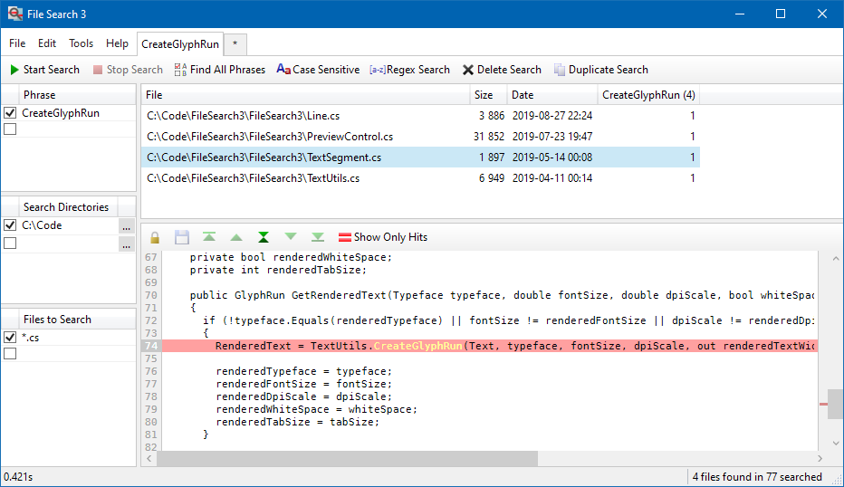
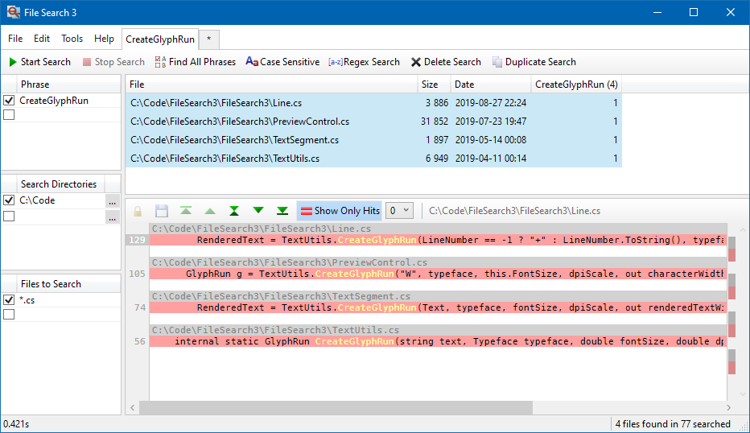
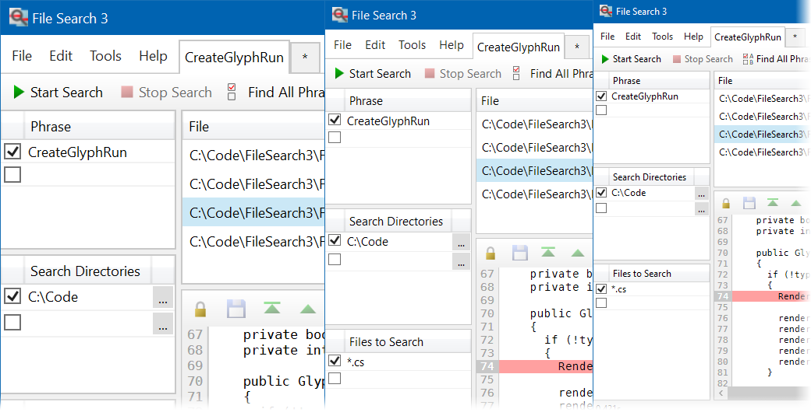

File Search 3.0
=============

A file searching application with a rich user interface. 

### Download
Download latest version **[HERE](https://jonashertzman.github.io/FileSearch3/download/FileSearch3.zip)**

### Features
- Tabbed interface with support for multiple ongoing searches
- Search for multiple phrases in multiple file types in multiple directories
- Combined multi file preview
- Regex search
- Editing files in the preview
- High DPI support

### Screen shots
  
*Normal preview.*

  
*Condensed preview.*

  
*Full DPI support.*
